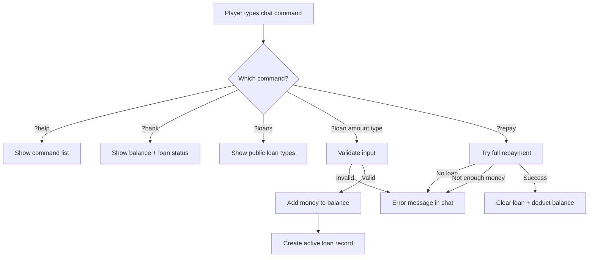
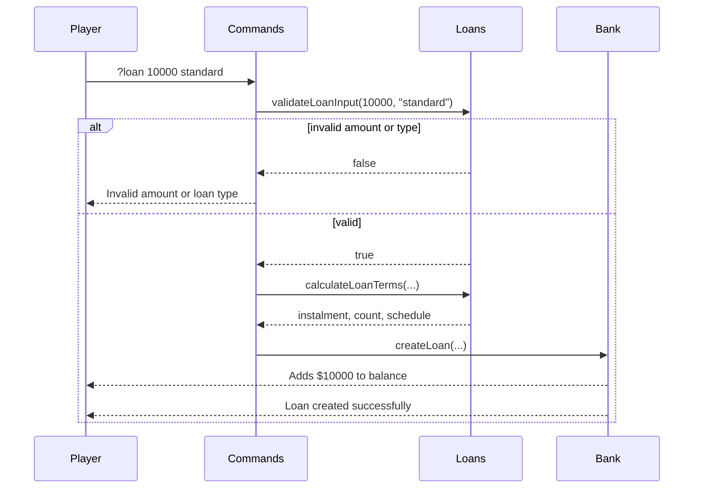
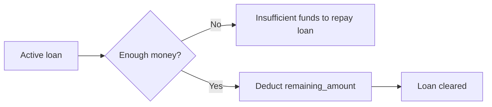
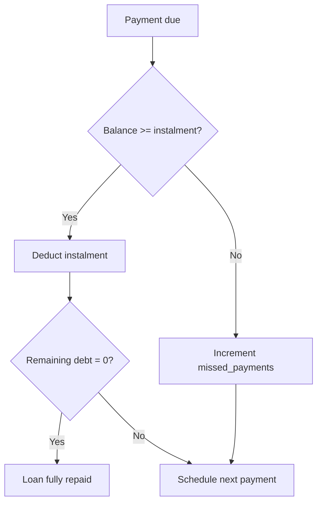

# StormBank

A [Stormworks: Build and Rescue](https://store.steampowered.com/app/573090/Stormworks_Build_and_Rescue/) addon that adds a simple banking system. Players can borrow money, repay in instalments with interest, check their financial status, or pay off a loan in full.

---

## Features

- **Multiple loan products** — standard, quick, and long-term plans with different instalment counts and interest rates
- **Automatic instalments** — the server deducts payments on schedule when you have enough money
- **Early full repayment** — pay off the entire remaining balance at any time with `?repay`
- **Missed payment tracking** — instalments you cannot afford are recorded as missed payments
- **One active loan per save** — you cannot take a second loan until the current one is cleared

---

## Commands

All commands are typed in the in-game chat.

| Command | Description |
|---------|-------------|
| `?help` | List all StormBank commands |
| `?bank` | Show your current balance and loan status |
| `?loans` | List available public loan types |
| `?loan <amount> <type>` | Borrow money using a loan type |
| `?repay` | Pay off your entire remaining loan balance |

### Command flow



### Taking a loan



**Example**

```
?loan 10000 standard
```

This borrows **$10,000** immediately. You repay **$11,000** total (10% interest) in **12 instalments** of **$917**, due every **30 in-game days**.

### Checking your status

```
?bank
```

Shows your current balance, original loan amount, remaining debt, instalment size, payments left, days until the next due date, and missed payments.

### Repaying early

```
?repay
```

Pays the **full remaining balance** in one go. Requires enough money in your account. Clears the loan immediately.



---

## Loan types

Public loan types (shown by `?loans`):

| Type | Instalments | Interest | Max amount | Payment interval |
|------|-------------|----------|------------|------------------|
| `standard` | 12 | 10% | $1,000,000 | every 30 days |
| `quick` | 6 | 8% | $500,000 | every 30 days |
| `long` | 24 | 30% | $5,000,000 | every 30 days |

**How interest is calculated**

```
total_repayment = ceil(amount × (1 + interest_rate))
instalment      = ceil(total_repayment / instalments)
```

**Example — `?loan 1000 standard`**

| | Value |
|---|------|
| Borrowed | $1,000 |
| Total to repay | $1,100 |
| Instalment | $92 |
| Instalments | 12 |

### Automatic payments

The addon checks for due payments periodically on the server tick. When a payment date is reached:



If you cannot afford an instalment, the payment is skipped, a missed payment is recorded, and the next due date is still advanced.

---

## Project structure

```
addon-stormbank/
├── script.lua       # Addon entry point (onCreate, onTick, onCustomCommand)
├── bank.lua         # Loan creation, payments, full repayment
├── loans.lua        # Loan type definitions and term calculation
├── commands.lua     # Chat command handling
├── displays.lua     # Help and status text formatting
├── definitions/
│   └── intellisense.lua   # API type definitions for the IDE
└── tests/
    ├── loans_test.lua
    └── bank_test.lua
```

---

## Development

This project is built with the **LifeBoatAPI** VSCode extension for Stormworks addon development.

### Running tests

Tests live in `tests/` and are **not** loaded by the addon in-game.

1. Open a test file (e.g. `tests/loans_test.lua`)
2. Press **F5** (Run Lua)

Or from the project root:

```powershell
lua tests/loans_test.lua
lua tests/bank_test.lua
```

### Building for the game

Press **F7** in VSCode to build/minimize the addon for Stormworks (LifeBoatAPI build step).

---

## Credits

### LifeBoatAPI

This addon was developed using **[LifeBoatAPI](https://github.com/nameouschangey/Stormworks_LifeBoatAPI_Addon)** and the **[Stormworks Lua VSCode extension](https://github.com/nameouschangey/STORMWORKS_VSCodeExtension)** by **Nameous Changey**.

Thank you to Nameous Changey and contributors for making Stormworks addon development in VSCode practical.

- Extension: [STORMWORKS_VSCodeExtension](https://github.com/nameouschangey/STORMWORKS_VSCodeExtension)
- LifeBoatAPI library: [Stormworks_LifeBoatAPI_Addon](https://github.com/nameouschangey/Stormworks_LifeBoatAPI_Addon)

